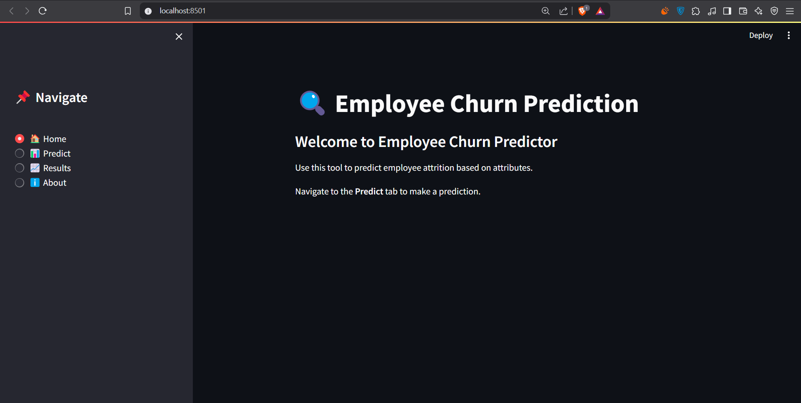
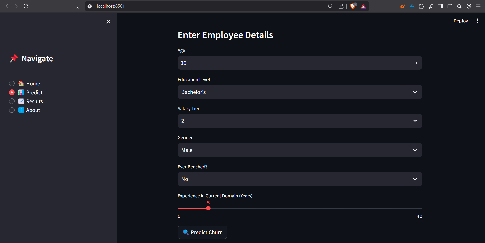
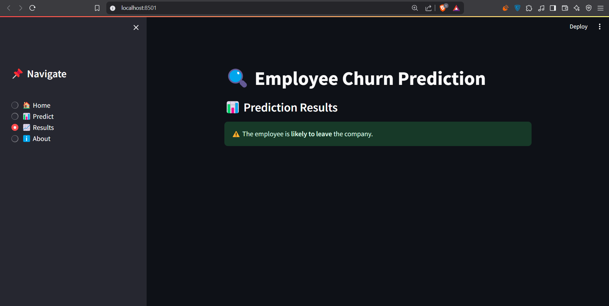
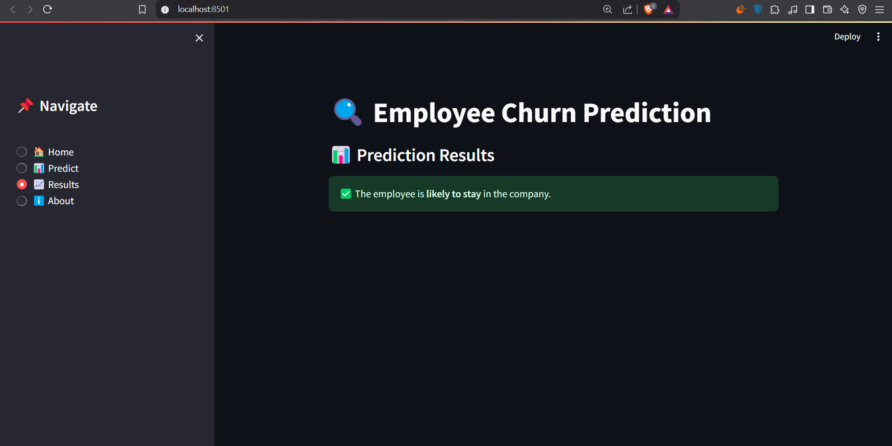
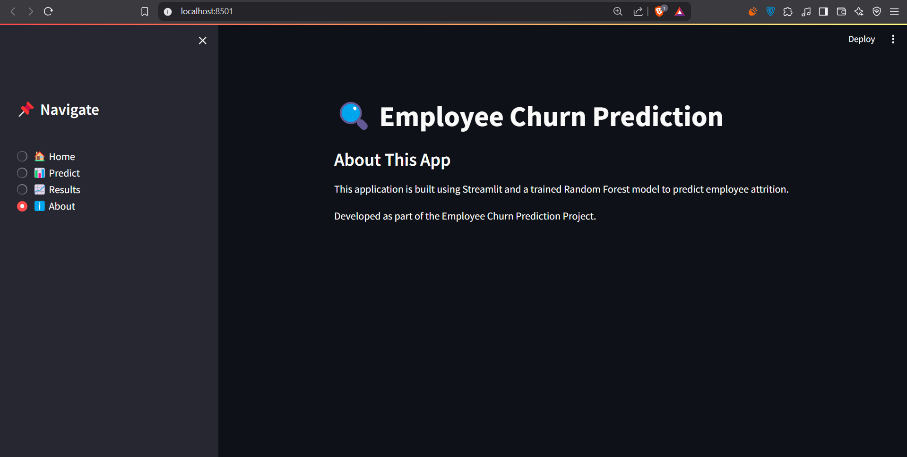

# employee-churn-prediction
# Employee Churn Prediction

## 📌 Overview
This project predicts whether an employee will leave the company based on various attributes using a **Random Forest Classifier**. The application is built using **Streamlit** for UI and **Scikit-Learn** for machine learning.

## 🏗️ Project Structure
```
app/
│── app.py               # Streamlit UI Application
│
model/
│── random_forest.pkl    # Trained Model
│
notebooks/
│── eda.ipynb            # Exploratory Data Analysis
│── model_training.ipynb # Model Training and Evaluation
│
screenshots/
│── Home.png
│── Predict.png
│── Result1.png
│── Result2.png
│── About.png
│
requirements.txt         # Project dependencies
README.md                # Project Documentation
requir
```

## 🚀 Features
- User-friendly UI for predicting employee churn.
- Trained **Random Forest** model with **98% accuracy**.
- **Handles categorical encoding & scaling**.
- **Displays results on a separate page** for better clarity.

## 📸 Screenshots
### 🏠 Home Page


### 🔍 Prediction Page


### 📊 Results Page



### ℹ️ About Page


## 🛠️ Installation
### 1️⃣ Clone the Repository
```sh
git clone https://github.com/ankurm9/employee-churn-prediction.git
cd employee-churn-prediction
```

### 2️⃣ Install Dependencies
```sh
pip install -r requirements.txt
```

### 3️⃣ Run the Streamlit App
```sh
streamlit run app/app.py
```

## 📌 How to Use
1. Navigate to **Predict**.
2. Fill in the employee details.
3. Click **Predict Churn**.
4. View the prediction results on a separate page.

## 🏆 Model Performance
- **Algorithm:** Random Forest
- **Accuracy:** 98%
- **Precision, Recall & F1-score:** High performance across all metrics.

## 📜 License
This project is licensed under the MIT License.

